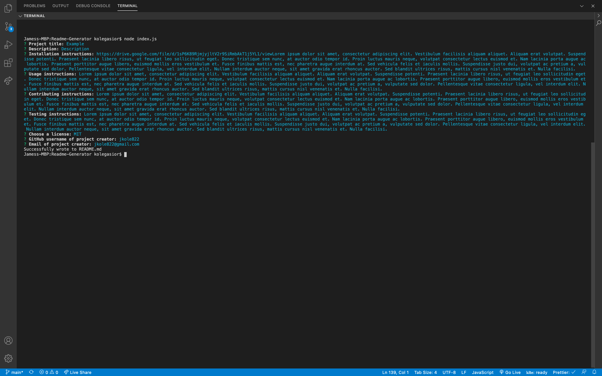
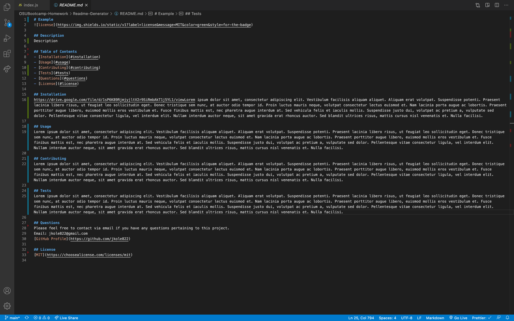

# Readme Generator

## Description

A command line application that generates a professional README.md file from a user's input using the inquirer package.

## Table of Contents

- [Visuals](#visuals)
- [Walkthrough Video](#walkthrough)
- [Installation](#installation)
- [Usage](#usage)
- [Questions](#questions)
- [License](#license)

## Visuals

### README Generator Command Line Prompts

### Resulting README.md File

## Walkthrough
[Video walkthrough](https://drive.google.com/file/d/1sP6K89RjmjyjltV2r9SiRmbAkT1j5YL1/view)

## Installation

After cloning the project, simply run `npm install` to install the inquirer package.

## Usage

Run `node index.js` to start up the application and answer a series of prompts via the command line to provide the content of the README.md file. While most of the prompts are optional, you must provide a `Title`, `Description`, and `License`.

## Questions

Please feel free to contact via email if you have any questions pertaining to this project.  
Email: jkole822@gmail.com  
[GitHub Profile](https://github.com/jkole822)

## License

[MIT](https://choosealicense.com/licenses/mit)
